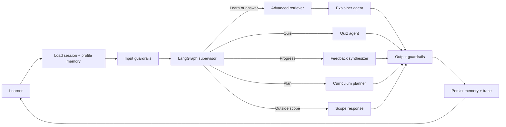

# PyMentor: Personalized Python Tutor

CSAI 422 capstone project, Option B. PyMentor is a curriculum-aware Python tutor that
uses LangGraph, advanced retrieval, persistent learner memory, pedagogical guardrails,
and a reproducible evaluation suite.

**Team**

| Student ID | Name |
|---|---|
| 202301506 | Seif Mohamed |
| 202301486 | Patrick Saweris |

## Rubric coverage

- **Advanced RAG:** baseline lexical retrieval versus metadata-aware BM25-style hybrid
  retrieval with deterministic reranking and source tracing.
- **Multi-agent LangGraph:** supervisor, curriculum planner, retriever, explainer, quiz
  agent, feedback synthesizer, and guardrail nodes.
- **Memory:** full session history, persisted student profile, quiz history, and structured
  misconception log in SQLite.
- **Guardrails:** prompt-injection defense, answer withholding, curriculum scope control,
  confidence calibration, secret redaction, and prompt-leakage protection.
- **Evaluation:** 32 synthetic conversations, three learner personas, retrieval precision
  and recall, routing accuracy, pedagogical compliance, grounding rate, P95 latency, an
  optional LLM judge, and optional RAGAS evaluation.

## Architecture



The graph state explicitly carries the learner message, intent, topic, profile, recent
session history, retrieved chunks, confidence, guardrail flags, and final response.
Routing is inspectable and bounded; the model does not control arbitrary code execution.

## Setup

Python 3.9 or newer is required. Ollama and `qwen3:4b` are already installed on the
development machine.

```bash
python3 -m venv .venv
source .venv/bin/activate
pip install -e ".[demo,eval,test]"
cp .env.example .env
```

Choose one provider in `.env`:

```bash
# Local and private
LLM_PROVIDER=ollama
OLLAMA_MODEL=qwen3:4b

# Hosted and stronger
LLM_PROVIDER=groq
GROQ_API_KEY=your_new_key_here
GROQ_MODEL=llama-3.3-70b-versatile
```

Never commit `.env`. A Groq key previously embedded in a course notebook must be revoked
before reuse.

## Run

Confirm Ollama is available:

```bash
ollama serve
ollama list
```

Run a command-line smoke test:

```bash
python scripts/smoke_test.py
```

Run the demo:

```bash
streamlit run app.py
```

## Test and evaluate

Unit tests do not call an LLM:

```bash
pytest -q
```

Evaluate baseline and advanced retrieval:

```bash
python evaluation/run_evaluation.py
```

Run all 32 conversations through the configured model:

```bash
python evaluation/run_evaluation.py --live
python evaluation/llm_judge.py
```

Run the controlled three-persona pre/post assessment:

```bash
python evaluation/learning_assessment.py
```

The report file at `evaluation/results/latest.json` contains the metrics and case-level
evidence. Preserve this file before submission and copy its measured values into the
written report. Do not claim placeholder metrics.

## Repository map

```text
src/python_tutor/     LangGraph, agents, retrieval, memory, providers, guardrails
data/knowledge/       Indexed CSAI 106 Python learning material
evaluation/           32 test cases, metrics, and LLM-as-judge
tests/                Deterministic unit tests
docs/                 Report, disclosure, oral-exam preparation
app.py                Streamlit live demo
```

## Design decisions

1. **Python subject:** supports objective quizzes, executable examples, misconception
   detection, and measurable pre/post learning.
2. **Direct provider adapter:** keeps Groq and Ollama interchangeable without coupling
   graph logic to one SDK.
3. **Hybrid retrieval:** term weighting, metadata boosts, title coverage, and reranking
   are transparent enough to explain during the oral exam.
4. **SQLite memory:** persistent, inspectable, easy to demo, and sufficient for the
   capstone scale.
5. **Hint-first enforcement:** deterministic detection happens before model generation,
   so the policy does not depend only on prompt compliance.

## Known limitations

- The current corpus is intentionally compact and should be expanded with instructor
  materials or official Python documentation before final evaluation.
- Quiz grading and misconception extraction should be extended with explicit structured
  schemas in the next iteration.
- The advanced retriever is lexical-hybrid rather than embedding-based, making it easy to
  run offline but weaker on paraphrases.
- Final scores depend on the configured model and must be generated on the submission
  machine.
