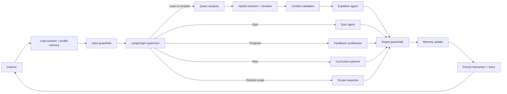

# PyMentor: Personalized Python Tutor

CSAI 422 capstone project, Option B. PyMentor is a curriculum-aware Python tutor that
uses LangGraph, advanced retrieval, persistent learner memory, pedagogical guardrails,
and a reproducible evaluation suite.

**Team**

| Student ID | Name |
|---|---|
| 202301506 | Seif Mohamed |
| 202301486 | Patrick Saweris |

## Rubric coverage

- **Advanced RAG:** baseline lexical retrieval versus metadata-aware BM25-style hybrid
  retrieval with deterministic reranking and source tracing.
- **Multi-agent LangGraph:** supervisor, curriculum planner, retriever, explainer, quiz
  agent, feedback synthesizer, and guardrail nodes.
- **Memory:** full session history, persisted student profile, quiz history, and structured
  misconception log in SQLite.
- **Guardrails:** prompt-injection defense, answer withholding, curriculum scope control,
  confidence calibration, secret redaction, and prompt-leakage protection.
- **Evaluation:** 32 synthetic conversations, three learner personas, retrieval precision,
  recall, MRR, hit@1, routing accuracy, pedagogical compliance, grounding rate, P95
  latency, an Ollama LLM judge, and a controlled RAGAS comparison.

## Problem statement

Generic tutors do not remember where a learner struggled, may answer from unsupported
knowledge, and often give away assignment solutions. PyMentor addresses those failure modes
with bounded agent routing, source-grounded teaching, persistent learner evidence, and
deterministic safety checks around the model.

## System architecture



The graph state explicitly carries the learner message, intent, topic, profile, recent
session history, structured session memory, query analysis, retrieved chunks, validation
reason, confidence, guardrail flags, personalization evidence, and final response. Routing
is deterministic and bounded; the model cannot select arbitrary tools or execute code.

### Node responsibilities

| Node | Input | Output and reason |
|---|---|---|
| Load Memory | learner and session IDs | Loads working memory, long-term profile, misconceptions, and recent dialogue before routing. |
| Input Guardrails | raw message | Sanitized message plus injection and answer-withholding flags. |
| Supervisor | safe message | One explainable intent and topic. |
| Query Analysis | intent, topic, profile | Normalized retrieval query and topic-specific personalization evidence. |
| Retriever | analyzed query | Metadata-aware BM25-style candidates and deterministic reranking. |
| Context Validation | ranked chunks | Confidence, sufficiency decision, and explicit rejection reason. |
| Explainer | validated context and memory | Grounded teaching with a check question. |
| Quiz Agent | topic and learner level | One grounded question without the solution. |
| Curriculum Planner | persistent profile | Prerequisite-aware next steps. |
| Feedback Synthesizer | stored evidence | Progress summary without invented performance. |
| Memory Update | safe response and learner message | Session state plus structured misconception evidence. |
| Persist | final state | Sanitized user/assistant interaction. |

## Memory design

PyMentor uses one SQLite database with three distinct logical layers:

| Layer | Stored fields | How the tutor uses it |
|---|---|---|
| Session memory | topic, current question, confusion, goal, recent messages | Maintains continuity inside the active learning task. |
| Long-term profile | level, goals, strengths, weaknesses, completed topics, progress | Calibrates difficulty and curriculum recommendations across sessions. |
| Misconception memory | topic, misconception, evidence, frequency, severity, recommended fix | Forces future explanations to revisit a previously observed weakness. |

For example, if the learner previously treated the stop value of `range` as inclusive, a
later loops explanation begins by acknowledging that history and prioritizes exclusive-stop
practice. The behavior is verified in `tests/test_graph_behavior.py` and
`evaluation/personalization_evaluation.py`.

## RAG pipeline

```text
Question -> query normalization -> retrieval decision -> BM25-style hybrid scoring
         -> metadata boosts -> deterministic reranking -> relative-score filtering
         -> context validation -> grounded generation or explicit uncertainty
```

The baseline retriever is preserved for comparison. The improved retriever expands topic
aliases, combines lexical and metadata signals, reranks for coverage and concision, filters
weak candidates, and rejects context when query coverage is insufficient. A large vector
database was deliberately not added: the compact course corpus does not justify the
operational dependency, and the current transparent scoring is easier to inspect in an oral
defense. Embeddings remain a documented future extension for paraphrase-heavy queries.

## Setup

Python 3.9 or newer is required. Ollama and `qwen3:4b` are already installed on the
development machine.

```bash
python3 -m venv .venv
source .venv/bin/activate
pip install -e ".[demo,eval,test]"
cp .env.example .env
```

Choose one provider in `.env`:

```bash
# Local and private
LLM_PROVIDER=ollama
OLLAMA_MODEL=qwen3:4b

# Hosted and stronger
LLM_PROVIDER=groq
GROQ_API_KEY=your_new_key_here
GROQ_MODEL=llama-3.3-70b-versatile
```

Never commit `.env`. A Groq key previously embedded in a course notebook must be revoked
before reuse.

## Run

Confirm Ollama is available:

```bash
ollama serve
ollama list
```

Run a command-line smoke test:

```bash
python scripts/smoke_test.py
```

Run the demo:

```bash
streamlit run app.py
```

The GUI includes:

- A learner profile sidebar with ability, goals, session controls, and persistent memory
- A branded dashboard showing strengths, focus areas, and stored memory signals
- One-click concept, quiz, learning-plan, progress, and curriculum-topic actions
- Source-grounded chat responses with confidence, guardrail, and personalization indicators
- Expandable retrieval evidence and an explicit recommended next learning step
- Responsive styling for desktop and narrow browser widths

## Test and evaluate

Unit tests do not call an LLM:

```bash
pytest -q
```

Evaluate baseline and advanced retrieval:

```bash
python evaluation/run_evaluation.py
```

Run all 32 conversations through the configured model:

```bash
python evaluation/run_evaluation.py --live
python evaluation/llm_judge.py
```

Run the controlled three-persona pre/post assessment:

```bash
python evaluation/learning_assessment.py
python evaluation/personalization_evaluation.py
```

Run the controlled baseline-versus-improved RAG quality comparison:

```bash
python evaluation/rag_quality_comparison.py --limit 10
```

The report file at `evaluation/results/latest.json` contains the metrics and case-level
evidence used in the written report.

## Measured results

Final measurements were produced locally with Ollama `qwen3:4b` on June 13, 2026.

| Measure | Baseline | Improved / final |
|---|---:|---:|
| Retrieval context precision (20 labeled cases) | 0.679 | **0.946** |
| Retrieval context recall | 0.950 | **1.000** |
| Retrieval query-term relevance | 0.438 | **0.593** |
| Mean reciprocal rank | 0.892 | **1.000** |
| Hit@1 | 0.850 | **1.000** |
| Controlled RAGAS faithfulness (10 cases) | 0.709 | **0.940** |
| Controlled answer relevance | 0.512 | **0.590** |

The complete 32-case system run achieved 1.000 deterministic pedagogical compliance,
1.000 routing accuracy, and 1.000 grounded-response or safe-abstention rate. The independent
LLM judge scored 0.992. P95 and median local latency were 31.21 and 22.01 seconds.

The three-persona personalization evaluation achieved 1.000 memory-use, grounded-response,
and teaching-check rates. The controlled RAGAS context-relevance score moved from 0.743 to
0.718 because the improved pipeline deliberately returns fewer, narrower chunks; the broader
20-case retrieval benchmark shows that the retained chunks have higher query coverage and
substantially higher precision.

## Repository map

```text
src/python_tutor/     LangGraph, agents, retrieval, memory, providers, guardrails
data/knowledge/       Indexed CSAI 106 Python learning material
evaluation/           32 test cases, metrics, and LLM-as-judge
tests/                Deterministic unit tests
docs/                 Report, disclosure, oral-exam preparation
app.py                Streamlit live demo
```

## Design decisions

1. **Python subject:** supports objective quizzes, executable examples, misconception
   detection, and measurable pre/post learning.
2. **Direct provider adapter:** keeps Groq and Ollama interchangeable without coupling
   graph logic to one SDK.
3. **Validated hybrid retrieval:** query expansion, term weighting, metadata boosts,
   title coverage, reranking, filtering, and confidence checks remain inspectable.
4. **SQLite memory:** persistent, inspectable, easy to demo, and sufficient for the
   capstone scale.
5. **Hint-first enforcement:** deterministic detection happens before model generation,
   so the policy does not depend only on prompt compliance.

## Guardrail test matrix

| Case | Expected behavior | Automated evidence |
|---|---|---|
| Direct assignment solution | Give a hint and Socratic question, not finished code | `test_required_guardrail_behaviors` |
| Prompt injection | Refuse prompt disclosure and role override | `test_prompt_injection_is_blocked` |
| Off-topic request | Redirect to the indexed Python curriculum | `test_required_guardrail_behaviors` |
| Unknown Python knowledge | Admit insufficient grounded context | `test_context_validation_rejects_unknown_python_topics` |

## Demonstrate personalization

```bash
python evaluation/personalization_evaluation.py
```

The script seeds beginner, intermediate, and advanced learner evidence, then invokes the
real graph with deterministic fallback generation. Inspect
`evaluation/results/personalization.json` to see the exact memory evidence used in each
response.

## Known limitations

- The current corpus is intentionally compact and should be expanded with instructor
  materials or official Python documentation before final evaluation.
- Misconception extraction is deliberately limited to high-precision known patterns; a
  production system should add reviewed structured quiz grading.
- The advanced retriever is lexical-hybrid rather than embedding-based, making it easy to
  run offline but weaker on paraphrases.
- Local Qwen can fall back to deterministic grounded output when it exhausts its answer
  budget. This improves reliability but reduces stylistic variety.
